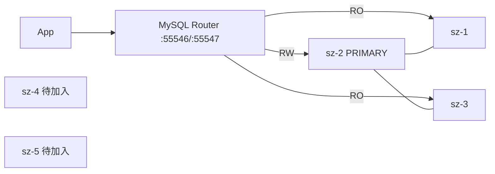

# MySQL InnoDB Cluster（mysql-prod-cluster）

**MySQL 8.4 + Group Replication（单主）+ MySQL Router**，宿主机目录 `/docker/mysql/mysql-prod-cluster`。

| 项 | 值 |
|----|-----|
| 集群名 | `xhcCluster` |
| GR group name | `e6c3b9a0-710a-11f1-977a-00163e0e62ed` |
| MySQL 端口 | `55511`（`network_mode: host`） |
| Router RW / RO | 宿主机 `55546`→6446 / `55547`→6447 |
| 镜像 | `mysql:8.4`、`container-registry.oracle.com/mysql/community-router:8.4` |
| 模式 | `group_replication_single_primary_mode=ON`，通信栈 `MYSQL` |

## 1. 当前拓扑（扩容前 = 3 节点）

| 节点 | 内网 IP | server-id | 角色（采样时） | 数据目录 | buffer_pool |
|------|---------|-----------|----------------|----------|-------------|
| sz-1 | 172.29.240.103 | 1 | SECONDARY | 约 9G | 4G |
| sz-2 | 172.29.240.104 | 2 | **PRIMARY** | 约 6.5G | 4G |
| sz-3 | 172.29.240.105 | 103 | SECONDARY | 约 8.3G | 2G |
| sz-4 | 172.29.238.1 | 4（拟） | **待加入** | 无 | 拟 4G |
| sz-5 | 172.29.238.2 | 5（拟） | **待加入** | 无 | 拟 4G |

- 五机 `/etc/hosts` 已互相解析；sz-4/5 → sz-1/2/3:`55511` 已通。
- SSH 端口为 **9117**（非 22）。
- Clone 插件已 `ACTIVE`，适合 `addInstance` + clone 恢复。



## 2. 目录结构（每节点）

```text
/docker/mysql/mysql-prod-cluster/
├── docker-compose.yml
├── conf/my.cnf          # 节点差异：server-id / report_host / relay-log
├── data/                # datadir（新节点初始为空，clone 时覆盖）
├── log/
└── router/              # Router bootstrap 产物
```

本仓库模板见 `templates/`。

---

## 3. 初次搭建回顾（已完成的 3 节点）

以下为现网重建/对照流程，**非本次扩容步骤**。

1. 三机准备目录、`my.cnf`（唯一 `server-id`、`report_host`、`relay-log`）、`docker-compose.yml`。
2. 启动 `mysql8-prod-cluster`，确认 `55511` 可互相访问。
3. 用 **MySQL Shell** 在种子节点创建集群：
   ```javascript
   dba.configureInstance('root@sz-1:55511')
   var cluster = dba.createCluster('xhcCluster')
   cluster.addInstance('root@sz-2:55511', {recoveryMethod: 'clone'})
   cluster.addInstance('root@sz-3:55511', {recoveryMethod: 'clone'})
   cluster.status()
   ```
4. 创建 Router 用户后，各机 bootstrap / 启动 `mysql-prod-router`（`MYSQL_INNODB_CLUSTER_MEMBERS=3`）。
5. 应用连 Router：`host:55546`（读写）、`host:55547`（只读）。

---

## 4. 扩容到 5 节点（拟执行，待确认）

### 4.1 影响评估（请先确认）

| 影响面 | 说明 |
|--------|------|
| 业务读写 | **预期不停机**。现网 3 节点保持 ONLINE；扩容用 clone，不改现网 `my.cnf`/不重启现有 mysqld。 |
| PRIMARY 负载 | Clone donor 默认走 PRIMARY（当前 **sz-2**）。约 **7–9G** 数据拷贝期间，sz-2 **磁盘 IO / 内网带宽** 升高；大事务窗口建议避开业务高峰。可选：指定 SECONDARY 作 donor（仍建议业务低峰）。 |
| 多数派 | 3 节点 majority=2 → 5 节点 majority=3，**容错从丢 1 升到丢 2**。 |
| Router | 需把各机 compose 中 `MYSQL_INNODB_CLUSTER_MEMBERS` **3→5** 并重启 Router（秒级，应用若只连 Router 可能有极短断连）。`state.json` 会随 metadata 自动纳入新成员。 |
| 配置变更（旧节点） | **不必改**现有 mysqld 的 `group_replication_group_seeds`（由 AdminAPI 维护）。`ip_allowlist=AUTOMATIC` 覆盖 `172.16.0.0/12`，sz-4/5（`172.29.238.x`）与旧网段兼容。 |
| 新节点 | 需拉镜像、建空目录、首次初始化实例，再 `addInstance`；clone 会清空新节点 datadir 再灌数。 |
| 回滚 | 若加入失败：`cluster.removeInstance(...)` 或停掉新节点容器即可，旧 3 节点不受影响。 |

### 4.2 扩容步骤（确认后再执行）

**A. 新节点准备（sz-4 / sz-5）**

```bash
# 每台新机
mkdir -p /docker/mysql/mysql-prod-cluster/{conf,data,log,router}
# 同步本仓库 templates → 对应节点，改 hostname/server-id/report_host/relay-log
# 拉镜像
docker pull mysql:8.4
docker pull container-registry.oracle.com/mysql/community-router:8.4

cd /docker/mysql/mysql-prod-cluster
docker compose up -d mysql
# 确认本机 :55511 起来，且旧节点能连上
```

**B. 用 MySQL Shell 加入集群（在管理机或 PRIMARY 上）**

```bash
# 若主机无 mysqlsh，可用官方 shell 镜像（示例）
docker run -it --rm --network host mysql/mysql-shell:8.4
```

```javascript
\c root@sz-2:55511
var cluster = dba.getCluster('xhcCluster')
cluster.status()

// 建议低峰；recoveryMethod 用 clone（已装 clone 插件）
cluster.addInstance('root@sz-4:55511', {recoveryMethod: 'clone', recoveryProgress: 2})
cluster.addInstance('root@sz-5:55511', {recoveryMethod: 'clone', recoveryProgress: 2})

cluster.status()
```

期望：五成员均为 `ONLINE`；PRIMARY 仍为原主（除非中途故障转移）。

**C. 更新 Router（所有已跑 Router 的节点，以及可选在 sz-4/5 新起）**

1. `docker-compose.yml`：`MYSQL_INNODB_CLUSTER_MEMBERS: "5"`
2. `docker compose up -d mysql-router`（或 recreate）
3. 核对 `router/data/state.json` 是否出现 `sz-4`/`sz-5`

**D. 验收**

```sql
SELECT MEMBER_HOST, MEMBER_PORT, MEMBER_STATE, MEMBER_ROLE
FROM performance_schema.replication_group_members;
```

```javascript
cluster.status({extended:1})
```

- 写：经任意 Router `55546` 插入，各节点可见。
- 读：`55547` 可落到 Secondary。

### 4.3 建议的 server-id / 资源

| 节点 | server-id | report_host | relay-log | innodb_buffer_pool_size |
|------|-----------|-------------|-----------|-------------------------|
| sz-4 | 4 | sz-4 | sz-4-relay-bin | 4G（与 sz-1/2 对齐） |
| sz-5 | 5 | sz-5 | sz-5-relay-bin | 4G |

> sz-3 历史 `server-id=103` 保持不动即可（只需全局唯一）。

### 4.4 明确不做的事（除非另有指示）

- 不重启现有 sz-1/2/3 的 `mysql8-prod-cluster`
- 不改集群名 / group name
- 不在高峰做 clone
- 不把生产密码写入本仓库明文（模板用占位符；真值在服务器 compose 内）

---

## 5. 常用运维

```bash
# 集群状态（PRIMARY 上）
docker exec mysql8-prod-cluster mysql -uroot -p -P55511 -e \
  "SELECT MEMBER_HOST,MEMBER_STATE,MEMBER_ROLE FROM performance_schema.replication_group_members"

# 重启本机 MySQL / Router
cd /docker/mysql/mysql-prod-cluster && docker compose restart mysql
cd /docker/mysql/mysql-prod-cluster && docker compose restart mysql-router
```

## 6. 端口一览

| 端口 | 用途 |
|------|------|
| 55511 | MySQL + GR（MYSQL 通信栈） |
| 55546 | Router 读写（classic） |
| 55547 | Router 只读（classic） |
| 6448/6449/6450/8443 | Router X / RW-split / REST（现网 compose 未映射到宿主机） |
