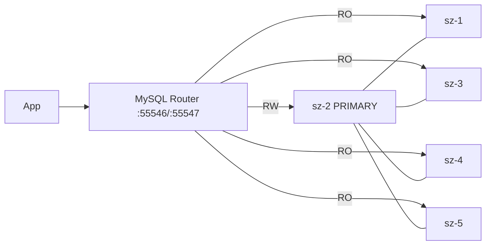

# MySQL InnoDB Cluster（mysql-prod-cluster）

**MySQL 8.4 + Group Replication（单主）+ MySQL Router**，宿主机目录 `/docker/mysql/mysql-prod-cluster`。

| 项 | 值 |
|----|-----|
| 集群名 | `xhcCluster` |
| GR group name | `e6c3b9a0-710a-11f1-977a-00163e0e62ed` |
| MySQL 端口 | `55511`（`network_mode: host`） |
| Router RW / RO | 宿主机 `55546`→6446 / `55547`→6447 |
| 镜像 | `mysql:8.4`、`container-registry.oracle.com/mysql/community-router:8.4` |
| 模式 | `group_replication_single_primary_mode=ON`，通信栈 `MYSQL` |
| Router 健康检查 | 容器内探测 `6446`+`6447`（`/dev/tcp`），Portainer 显示 `healthy` |

## 1. 当前拓扑（已扩容 = 5 节点，2026-08-06）

| 节点 | 内网 IP | server-id | 角色 | buffer_pool |
|------|---------|-----------|------|-------------|
| sz-1 | 172.29.240.103 | 1 | SECONDARY | 2G |
| sz-2 | 172.29.240.104 | 2 | **PRIMARY** | 4G |
| sz-3 | 172.29.240.105 | 3 | SECONDARY | 2G |
| sz-4 | 172.29.238.1 | 4 | SECONDARY | 2G |
| sz-5 | 172.29.238.2 | 5 | SECONDARY | 2G |

- 五机均跑 `mysql8-prod-cluster` + `mysql-prod-router`；Router `state.json` 含全部 5 成员。
- 容错：可容忍 **2** 节点故障。
- 扩容前全量备份：`sz-2:/docker/mysql/backup/mysql-prod-cluster_all_20260806_135020.sql.gz`（65M）。



## 2. 目录结构（每节点）

```text
/docker/mysql/mysql-prod-cluster/
├── docker-compose.yml
├── conf/my.cnf          # 节点差异：server-id / report_host / relay-log
├── data/                # datadir（新节点初始为空，clone 时覆盖）
├── log/
└── router/              # Router bootstrap 产物
```

本仓库模板见 `templates/`；新机目录准备用 `scripts/prepare-dirs.sh`（会 `chown 999:999` data/log/router）。

---

## 3. 初次搭建回顾（已完成的 3 节点）

以下为现网重建/对照流程，**非本次扩容步骤**。

1. 三机准备目录、`my.cnf`（唯一 `server-id`、`report_host`、`relay-log`）、`docker-compose.yml`。
2. 启动 `mysql8-prod-cluster`，确认 `55511` 可互相访问。
3. 用 **MySQL Shell** 在种子节点创建集群：
   ```javascript
   dba.configureInstance('root@sz-1:55511')
   var cluster = dba.createCluster('xhcCluster')
   cluster.addInstance('root@sz-2:55511', {recoveryMethod: 'clone'})
   cluster.addInstance('root@sz-3:55511', {recoveryMethod: 'clone'})
   cluster.status()
   ```
4. 创建 Router 用户后，各机 bootstrap / 启动 `mysql-prod-router`（`MYSQL_INNODB_CLUSTER_MEMBERS=3`）。
5. 应用连 Router：`host:55546`（读写）、`host:55547`（只读）。

---

## 4. 扩容到 5 节点（已完成）

### 4.1 实际影响

| 影响面 | 结果 |
|--------|------|
| 业务读写 | 未重启旧节点 mysqld；Router recreate 约秒级。 |
| Clone | sz-4 从 sz-2 克隆约 1.18GB / 4s；sz-5 从 sz-4 克隆同类速度。 |
| 多数派 | 已变为可容忍 **2** 失败。 |
| Router | sz-1/2/3 `MEMBERS` 3→5 并 recreate；sz-4/5 新 bootstrap 成功。 |

### 4.2 扩容步骤（操作记录）

**A. 新节点准备（sz-4 / sz-5）**

```bash
# 每台新机（推荐）
./scripts/prepare-dirs.sh
# 下发 conf/my.cnf（见 conf/my.cnf.sz-4、sz-5）与 docker-compose.yml（templates/）
# 镜像：Hub 慢时从已有节点 docker save + 内网 HTTP，再 docker load

cd /docker/mysql/mysql-prod-cluster
docker compose up -d mysql
```

注意：

- 新实例首次启动时 **尚未加载** `group_replication` 插件，`group_replication_transaction_size_limit=...` 会导致 Abort。应写为 `loose-group_replication_transaction_size_limit=...`，或等加入集群后再设（`cluster.set_option("transactionSizeLimit", ...)`）。
- `data/`、`log/`、`router/` 属主须为 **999:999**（官方镜像内 `mysql` 用户 uid；宿主机上可能显示为 lxd/pcp 等名字，以数字为准）。

**B. 用 MySQL Shell 加入集群（PRIMARY / 管理机）**

```bash
# Ubuntu 可 apt install mysql-shell；或：
# docker run -it --rm --network host mysql/mysql-shell:8.4
```

```javascript
\c root@sz-2:55511
var cluster = dba.getCluster('xhcCluster')
dba.configureInstance('root@sz-4:55511')
dba.configureInstance('root@sz-5:55511')
cluster.addInstance('root@sz-4:55511', {recoveryMethod: 'clone', recoveryProgress: 2})
cluster.addInstance('root@sz-5:55511', {recoveryMethod: 'clone', recoveryProgress: 2})
cluster.status()
```

期望：五成员 `ONLINE`；PRIMARY 仍为原主（除非中途故障转移）。

**C. 更新 Router**

1. 各机 `MYSQL_INNODB_CLUSTER_MEMBERS: "5"`
2. 旧节点 `docker compose up -d mysql-router --force-recreate`；新节点同样启动 Router（空 `router/` 会 bootstrap）
3. 核对 `router/data/state.json` 含 sz-1～sz-5

**D. 验收**

```sql
SELECT MEMBER_HOST, MEMBER_PORT, MEMBER_STATE, MEMBER_ROLE
FROM performance_schema.replication_group_members;
```

- 写：经任意 Router `55546` 插入，五节点可见。
- 读：`55547` 落到 Secondary。

### 4.3 现网 server-id / buffer_pool

| 节点 | server-id | report_host | relay-log | buffer_pool |
|------|-----------|-------------|-----------|-------------|
| sz-1 | 1 | sz-1 | sz-1-relay-bin | 2G × 2（SECONDARY） |
| sz-2 | 2 | sz-2 | sz-2-relay-bin | **4G × 4（PRIMARY）** |
| sz-3 | 3 | sz-3 | sz-3-relay-bin | 2G × 2 |
| sz-4 | 4 | sz-4 | sz-4-relay-bin | 2G × 2 |
| sz-5 | 5 | sz-5 | sz-5-relay-bin | 2G × 2 |

本仓库 `templates/my.cnf.tpl`、`conf/my.cnf.sz-4/5` 按 **SECONDARY 2G** 编写；PRIMARY 单独保持 4G。

### 4.4 扩容后已做的整理

- SECONDARY 统一 `innodb_buffer_pool_size=2G`（逐台重启从节点，PRIMARY 未动）。
- sz-3 原 `server-id=103`：官方要求仅「拓扑内唯一」，改号非必须。若要对齐为 3，稳妥做法是 `removeInstance` → 改 `my.cnf` → 清空 datadir 再起 → `addInstance(..., clone)`（已完成）。
- 密码不进仓库明文（compose 模板用占位符；真值仅在服务器）。

---

## 5. 常用运维

```bash
# 集群状态（PRIMARY 上）
docker exec mysql8-prod-cluster mysql -uroot -p -P55511 -e \
  "SELECT MEMBER_HOST,MEMBER_STATE,MEMBER_ROLE FROM performance_schema.replication_group_members"

# 重启本机 MySQL / Router
cd /docker/mysql/mysql-prod-cluster && docker compose restart mysql
cd /docker/mysql/mysql-prod-cluster && docker compose restart mysql-router
```

- `max_connections=1000`：现网峰值约 277，一般不必提到 2000（徒增每连接内存）。
- `binlog_expire_logs_seconds=259200`（**3 天**）：五节点已统一；过期由 mysqld 自动清理，也可 `PURGE BINARY LOGS BEFORE NOW() - INTERVAL 3 DAY`。

## 6. 端口一览

| 端口 | 用途 |
|------|------|
| 55511 | MySQL + GR（MYSQL 通信栈） |
| 55546 | Router 读写（classic） |
| 55547 | Router 只读（classic） |
| 6448/6449/6450/8443 | Router X / RW-split / REST（现网 compose 未映射到宿主机） |
