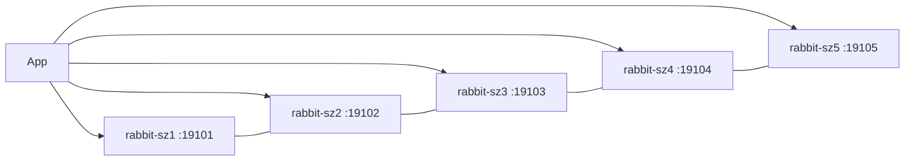

# RabbitMQ 4.3.1（Swarm 生产集群）

| 目录 | 用途 |
|------|------|
| `build/` | 自定义镜像（management + MQTT/STOMP/consistent-hash 等插件） |
| `docker-stack/` | Swarm 多节点生产栈（SZ 拓扑模板） |

镜像：`blankhang/rabbitmq:4.3.1-management`  
宿主机目录：`/docker/rabbitmq/rabbitmq-prod-stack`  
Stack 名：`rabbitmq-prod-stack`

仓库默认 `docker-stack/rabbitmq-stack.yml` 为 **5 节点**（与现网 SZ 一致）；首次也可只部署前 3 个服务，再按「无损扩容」加 4/5。

## 1. 当前拓扑（已扩容 = 5 节点，2026-08-07）

| 服务 | 节点约束 | 内网 IP | AMQP | Management | Web STOMP |
|------|----------|---------|------|------------|-----------|
| rabbit-sz1 | `xhc-sz-1` | 172.29.240.103 | 19101→5672 | 19111→15672 | 19121→15674 |
| rabbit-sz2 | `xhc-sz-2` | 172.29.240.104 | 19102→5672 | 19112→15672 | 19122→15674 |
| rabbit-sz3 | `xhc-sz-3` | 172.29.240.105 | 19103→5672 | 19113→15672 | 19123→15674 |
| rabbit-sz4 | `xhc-sz-4` | 172.29.238.1 | 19104→5672 | 19114→15672 | 19124→15674 |
| rabbit-sz5 | `xhc-sz-5` | 172.29.238.2 | 19105→5672 | 19115→15672 | 19125→15674 |

- 发现方式：`classic_config`（`rabbitmq-prod.conf` 中 `cluster_formation.classic_config.nodes.*`）
- Cookie：Swarm secret `rabbitmq_erlang_cookie`（全节点必须相同）
- 现网镜像本地别名：`blankhang/rabbitmq:4.3.1-szprod`（= `4.3.1-management`，见下文「镜像与 registry」）



---

## 2. 目录结构

**Manager（通常 sz-1）上的 stack 目录：**

```text
/docker/rabbitmq/rabbitmq-prod-stack/
├── rabbitmq-stack.yml
├── rabbitmq-prod.conf
├── rabbitmq_erlang_cookie.txt
├── data-rabbitmq-1/          # 仅本机有数据目录；其它机各有自己的 data-rabbitmq-N
└── (可选) definitions.json
```

**每台宿主机：**

```text
/docker/rabbitmq/rabbitmq-prod-stack/data-rabbitmq-N/   # N=节点号，chown 999:999
```

本仓库模板见 `docker-stack/`；新机目录可用：

```bash
./docker-stack/scripts/prepare-dirs.sh /docker/rabbitmq/rabbitmq-prod-stack 4
```

---

## 3. 自定义镜像构建

```bash
cd software/rabbitmq/4.3.1/build
docker build -t blankhang/rabbitmq:4.3.1-management .
```

默认启用 management、consistent-hash、MQTT/Web MQTT、Web STOMP、prometheus、federation、shovel 等（见 `build/config/enabled_plugins`）。

---

## 4. 从 0 搭建 3 节点集群

### 4.1 前置条件

- 目标机已加入 **Docker Swarm**，hostname 与 yml 中 `node.hostname == xhc-sz-N` 一致
- 五机互通 overlay；管理端口 / AMQP 按需对业务网开放
- 已构建或导入 `blankhang/rabbitmq:4.3.1-management`

### 4.2 准备 cookie 与配置

在 manager 上：

```bash
mkdir -p /docker/rabbitmq/rabbitmq-prod-stack
cd /docker/rabbitmq/rabbitmq-prod-stack

# cookie：全集群唯一且固定（勿泄漏到公开仓库）
openssl rand -hex 10 | tr 'a-z' 'A-Z' > rabbitmq_erlang_cookie.txt
# 或从示例复制后改成随机串：
# cp rabbitmq_erlang_cookie.txt.example rabbitmq_erlang_cookie.txt

# 拷贝本仓库 docker-stack 下的 yml / conf，改 default_user/default_pass
# 3 节点首次启动：可暂时注释 conf 中 nodes.4 / nodes.5，yml 也可先只保留 rabbit-sz1..3
```

### 4.3 各节点数据目录

```bash
# 在 sz-1 / sz-2 / sz-3 分别执行（N=1,2,3）
mkdir -p /docker/rabbitmq/rabbitmq-prod-stack/data-rabbitmq-N
chown -R 999:999 /docker/rabbitmq/rabbitmq-prod-stack/data-rabbitmq-N
```

新目录必须为空（不要拷贝其它节点的 `mnesia/`）。

### 4.4 分发镜像（Hub / 镜像站不可用时）

```bash
# 有镜像的节点
docker save -o /tmp/rabbitmq-4.3.1.tar blankhang/rabbitmq:4.3.1-management
# 内网 HTTP 或 scp 后：
docker load -i /tmp/rabbitmq-4.3.1.tar
```

若 Swarm 会错误解析私有镜像 digest，可打本地别名并在 yml 使用该 tag：

```bash
docker tag blankhang/rabbitmq:4.3.1-management blankhang/rabbitmq:4.3.1-szprod
# 各节点都要有同一 tag
```

### 4.5 部署

```bash
cd /docker/rabbitmq/rabbitmq-prod-stack
# 推荐：不向 registry 解析 digest（内网/镜像站常失败）
docker stack deploy --resolve-image never -c rabbitmq-stack.yml rabbitmq-prod-stack
```

`update_config` 为 `parallelism: 1` + `stop-first`，节点会严格串行启动，便于形成单一集群。

### 4.6 验收

```bash
docker stack services rabbitmq-prod-stack
CID=$(docker ps -q -f name=rabbitmq-prod-stack_rabbit-sz1)
docker exec $CID rabbitmqctl cluster_status
# Running Nodes 应为 rabbit-sz1..3（或 1..5）
```

Management UI：`http://<任意节点>:1911x`（账号见 `rabbitmq-prod.conf`）。

---

## 5. 无损扩容（3 → 5）

优先在现有集群加节点，**不必**新建集群再迁移。

### 5.1 影响面（现网实测）

| 影响面 | 结果 |
|--------|------|
| 集群数据 | 未重建；Mnesia/Khepri 在线加入 |
| 旧节点 | 更换 Swarm config 名后滚动重启（逐台，quorum 仍有多数） |
| classic 队列 | 无 HA policy 时仍单节点存放，不自动搬到新节点 |
| quorum 队列 | 入群后需 `rabbitmq-queues grow`，否则新节点不是 voter |
| 端口 | 旧 `19101–19103` 等已通过 ingress 占满全 Swarm，新节点用 **19104 / 19105** 系列 |

### 5.2 步骤

**A. 新机准备（sz-4 / sz-5）**

```bash
# 每台
./scripts/prepare-dirs.sh /docker/rabbitmq/rabbitmq-prod-stack 4   # 或 5
# 导入镜像并（如需）打本地别名 4.3.1-szprod
```

**B. 改配置（manager）**

1. `rabbitmq-prod.conf` 增加：

```ini
cluster_formation.classic_config.nodes.4 = rabbit-sz4@rabbit-sz4
cluster_formation.classic_config.nodes.5 = rabbit-sz5@rabbit-sz5
```

2. `rabbitmq-stack.yml` 增加 `rabbit-sz4` / `rabbit-sz5`（placement、volume、端口见上表）。
3. **Swarm config 不可变**：把 `configs` 名从例如 `rabbitmq_config_v430_1` 改为 `rabbitmq_config_v431_5n`，所有服务的 `configs.source` 同步改掉。

**C. 部署**

```bash
cd /docker/rabbitmq/rabbitmq-prod-stack
# 先备份
cp -a rabbitmq-stack.yml "rabbitmq-stack.yml.bak.$(date +%Y%m%d%H%M%S)"
cp -a rabbitmq-prod.conf "rabbitmq-prod.conf.bak.$(date +%Y%m%d%H%M%S)"

docker stack deploy --resolve-image never -c rabbitmq-stack.yml rabbitmq-prod-stack
```

新节点空数据启动后，靠 `classic_config` 自动入群。若未入群：

```bash
docker exec -it $(docker ps -q -f name=rabbitmq-prod-stack_rabbit-sz4) bash -lc '
  rabbitmqctl stop_app
  rabbitmqctl join_cluster rabbit-sz1@rabbit-sz1
  rabbitmqctl start_app
'
```

**D. 扩展 quorum 成员（必做）**

```bash
CID=$(docker ps -q -f name=rabbitmq-prod-stack_rabbit-sz1)
docker exec $CID rabbitmq-queues grow rabbit-sz4@rabbit-sz4 all
docker exec $CID rabbitmq-queues grow rabbit-sz5@rabbit-sz5 all
# 抽查
docker exec $CID rabbitmq-queues quorum_status 'queue.device.data.quorum.prod-sz'
```

**E. 验收**

```bash
docker exec $CID rabbitmqctl cluster_status
# Disk / Running Nodes = 5；Alarms / Network Partitions = none
docker stack services rabbitmq-prod-stack   # 全部 1/1
```

### 5.3 扩容后整理

- 保留 `.bak.*` 便于回滚对照
- 旧 config（`rabbitmq_config` / `v430_1`）可在确认无服务引用后 `docker config rm`
- 应用连接串若写死 3 节点，按需加上 sz4/sz5 或继续连任意存活节点

---

## 6. 镜像与 registry 注意点

- Swarm 默认会解析镜像 digest；私有镜像不在 DaoCloud 等白名单时，任务会长时间卡在 `Preparing`（拉镜像超时后才回退本地）。
- 生产建议：`docker stack deploy --resolve-image never`，并确保**每个**调度节点本地已有目标 tag。
- 现网曾用本地别名 `4.3.1-szprod` 避免与 Hub 上同名 tag 的错误 digest 纠缠；内容与 `4.3.1-management` 相同。

---

## 7. 更新 stack / 升级版本

改 yml 或 conf 后：

1. 若改了 conf 内容 → **必须换新的 config 名**再 deploy  
2. `docker stack deploy --resolve-image never -c rabbitmq-stack.yml rabbitmq-prod-stack`  
3. 滚动顺序由 `update_config` 控制（逐台 `stop-first`）

升级镜像：各节点先 load/pull 新 tag，改 yml 中 `image:` 后 deploy。

---

## 8. 移除 stack

```bash
docker stack rm rabbitmq-prod-stack
```

数据仍在宿主机 `data-rabbitmq-*`；删除前请自行备份。

---

## 自定义镜像构建

见 [`build/README.md`](build/README.md) 与 `build/Dockerfile`。

---

## HAProxy 统一入口（单地址客户端）

见 [`docker-stack/HAPROXY.md`](docker-stack/HAPROXY.md)。现网 stack 名：`rabbitmq-haproxy`，AMQP 端口 **19100**。
