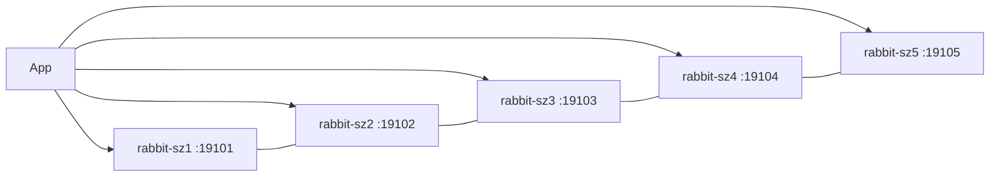

# RabbitMQ 4.3.4（Swarm 5 节点 · 从 0 到 1）

| 目录 | 用途 |
|------|------|
| `build/` | 自定义镜像（management + MQTT/STOMP/consistent-hash 等插件） |
| `docker-stack/` | Swarm 五节点生产栈（SZ 拓扑） |

镜像：`blankhang/rabbitmq:4.3.4-management`（基于官方 `rabbitmq:4.3.4-management`）  
宿主机目录：`/docker/rabbitmq/rabbitmq-prod-stack`  
Stack 名：`rabbitmq-prod-stack`

本文说明如何在 **Docker Swarm** 上从零部署 **5 节点** RabbitMQ 集群（classic_config 发现 + 统一 erlang cookie）。

## 1. 目标拓扑

| 服务 | 节点约束 | 内网 IP（示例） | AMQP | Management | Web STOMP |
|------|----------|-----------------|------|------------|-----------|
| rabbit-sz1 | `xhc-sz-1` | 172.29.240.103 | 19101→5672 | 19111→15672 | 19121→15674 |
| rabbit-sz2 | `xhc-sz-2` | 172.29.240.104 | 19102→5672 | 19112→15672 | 19122→15674 |
| rabbit-sz3 | `xhc-sz-3` | 172.29.240.105 | 19103→5672 | 19113→15672 | 19123→15674 |
| rabbit-sz4 | `xhc-sz-4` | 172.29.238.1 | 19104→5672 | 19114→15672 | 19124→15674 |
| rabbit-sz5 | `xhc-sz-5` | 172.29.238.2 | 19105→5672 | 19115→15672 | 19125→15674 |

- 发现：`cluster_formation.peer_discovery_backend = classic_config`（五个 `nodes.*` 写全）
- Cookie：Swarm secret，**五机相同**
- Ingress 会把已发布端口占满整个 Swarm，因此每节点端口必须不同（上表）



---

## 2. 目录结构

**Manager（通常 sz-1）stack 目录：**

```text
/docker/rabbitmq/rabbitmq-prod-stack/
├── rabbitmq-stack.yml              # 本仓库 docker-stack/ 拷贝
├── rabbitmq-prod.conf
├── rabbitmq_erlang_cookie.txt      # 勿提交真实 cookie
└── data-rabbitmq-1/                # 仅本机数据；其它机各有 data-rabbitmq-N
```

**每台宿主机各自：**

```text
/docker/rabbitmq/rabbitmq-prod-stack/data-rabbitmq-N/   # N=1..5，chown 999:999，首次必须为空
```

---

## 3. 构建镜像

```bash
cd software/rabbitmq/4.3.4/build
docker build -t blankhang/rabbitmq:4.3.4-management .
# 可选推送
# docker push blankhang/rabbitmq:4.3.4-management
```

默认启用：management、consistent-hash、MQTT/Web MQTT、Web STOMP、prometheus、federation、shovel 等（见 `build/config/enabled_plugins`）。

### 内网分发（Hub / 镜像站不可用时）

在已有镜像的节点：

```bash
docker save -o /tmp/rabbitmq-4.3.4.tar blankhang/rabbitmq:4.3.4-management
# 内网 HTTP 或 scp 到其余四机后：
docker load -i /tmp/rabbitmq-4.3.4.tar
```

**五台都必须有同一 tag。** 若 Swarm 会错误解析私有镜像 digest，可打本地别名并在 yml 改用该 tag：

```bash
docker tag blankhang/rabbitmq:4.3.4-management blankhang/rabbitmq:4.3.4-szprod
```

部署时建议始终加 `--resolve-image never`（见下文）。

---

## 4. 从 0 部署 5 节点

### 4.1 前置条件

- 五台主机已加入同一 **Docker Swarm**，hostname 与 yml 中 `node.hostname == xhc-sz-N` 一致
- overlay 互通；业务网可按需访问 `1910x` / `1911x` / `1912x`
- 已构建或导入 `blankhang/rabbitmq:4.3.4-management`（五机都有）

### 4.2 Manager 上准备文件

```bash
mkdir -p /docker/rabbitmq/rabbitmq-prod-stack
cd /docker/rabbitmq/rabbitmq-prod-stack

# 从本仓库拷贝
# cp -a <repo>/software/rabbitmq/4.3.4/docker-stack/{rabbitmq-stack.yml,rabbitmq-prod.conf} .
# cp <repo>/.../rabbitmq_erlang_cookie.txt.example rabbitmq_erlang_cookie.txt

# cookie：全集群唯一且固定
openssl rand -hex 10 | tr 'a-z' 'A-Z' > rabbitmq_erlang_cookie.txt

# 编辑 rabbitmq-prod.conf：改 default_user / default_pass
# 确认 classic_config.nodes.1..5 五个都在
```

`rabbitmq-stack.yml` 中 config 名示例：`rabbitmq_config_v434_5n`（Swarm config 不可变，以后改 conf 需换新名）。

### 4.3 五机数据目录

在 **每一台** 对应节点执行（或在本机对远程执行）：

```bash
# 仓库脚本（在目标机上）
./scripts/prepare-dirs.sh /docker/rabbitmq/rabbitmq-prod-stack 1
# … 2 / 3 / 4 / 5 各做一次（N 与节点号一致）
```

手工等价：

```bash
mkdir -p /docker/rabbitmq/rabbitmq-prod-stack/data-rabbitmq-N
chown -R 999:999 /docker/rabbitmq/rabbitmq-prod-stack/data-rabbitmq-N
chmod 700 /docker/rabbitmq/rabbitmq-prod-stack/data-rabbitmq-N
```

**不要**把其它节点的 `mnesia/` 拷过来；五机都是空目录首次启动。

### 4.4 部署

```bash
cd /docker/rabbitmq/rabbitmq-prod-stack
docker stack deploy --resolve-image never -c rabbitmq-stack.yml rabbitmq-prod-stack
```

`update_config` 为 `parallelism: 1` + `stop-first`，节点串行起来，便于形成**一个**集群而不是五个独立节点。

首次启动可能需数分钟（healthcheck `start_period: 180s`）。观察：

```bash
docker stack services rabbitmq-prod-stack
docker stack ps rabbitmq-prod-stack
```

若某任务长时间 `Preparing`：多半在拉 registry；确认该节点本地已有镜像，且使用了 `--resolve-image never`。

### 4.5 若某节点未自动入群

空数据节点通常靠 classic_config 自动加入。若 `cluster_status` 少节点，在该容器内：

```bash
docker exec -it $(docker ps -q -f name=rabbitmq-prod-stack_rabbit-sz4) bash -lc '
  rabbitmqctl stop_app
  rabbitmqctl join_cluster rabbit-sz1@rabbit-sz1
  rabbitmqctl start_app
'
```

（把 `sz4` 换成实际节点。）

---

## 5. 验收

```bash
docker stack services rabbitmq-prod-stack
# 五个服务均为 1/1

CID=$(docker ps -q -f name=rabbitmq-prod-stack_rabbit-sz1)
docker exec $CID rabbitmqctl cluster_status
```

期望：

- **Running Nodes / Disk Nodes** = `rabbit-sz1` … `rabbit-sz5`（共 5）
- **Alarms** / **Network Partitions** = none

Management UI：`http://<任意节点 IP>:1911x`（账号见 `rabbitmq-prod.conf`）。

应用可连任一节点的 `1910x:5672`；生产建议客户端配置多主机或前置负载均衡。

### 新建 quorum 队列的成员

首次创建的 quorum 队列会按当时集群成员组成副本。之后若再加节点，需对已有 quorum 执行 `rabbitmq-queues grow`（本版教程按一次到位 5 节点部署，一般创建队列时即已是 5 副本）。

---

## 6. 镜像与 registry 注意点

- Swarm 默认解析镜像 digest；私有镜像不在镜像站白名单时，任务会卡在 `Preparing`。
- 推荐：`docker stack deploy --resolve-image never`，并保证每个调度节点本地已有目标 tag。
- 可选本地别名（如 `4.3.4-szprod`）避免与 Hub 同名 tag 的错误 digest 纠缠。

---

## 7. 更新配置 / 升级

改 `rabbitmq-prod.conf` 内容后：

1. 换新的 Swarm config 名（如 `v434_5n` → `v434_5n_2`），yml 里五处 `source` 同步改  
2. `docker stack deploy --resolve-image never -c rabbitmq-stack.yml rabbitmq-prod-stack`  
3. 节点按 `stop-first` 逐台滚动

升级小版本：五机先 load/pull 新镜像 tag，改 yml `image:` 后再 deploy。

---

## 8. 移除

```bash
docker stack rm rabbitmq-prod-stack
```

数据仍在各机 `data-rabbitmq-*`；删目录前请自行备份。

---

## 构建说明

见 [`build/README.md`](build/README.md)。Stack 文件速查见 [`docker-stack/README.md`](docker-stack/README.md)。
