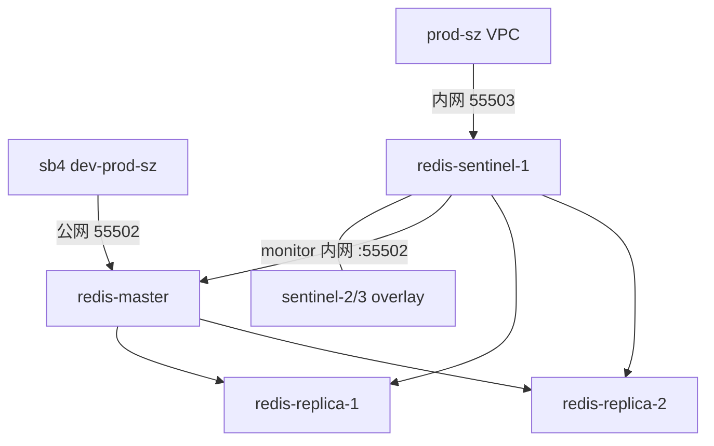

# Redis 8 Swarm Stack（1 主 2 从 3 Sentinel / 1m2r3s）

**Docker Swarm** 主从复制 + **3 节点 Sentinel** 自动故障转移（非 Redis Cluster）。

| 节点 | 公网 IP | 内网 IP（VPC） | 角色 | 发布端口 |
|------|---------|----------------|------|----------|
| sz-1 | `120.24.64.42` | `172.29.240.103` | master | **55502**（本 stack；**55002 留给旧 compose**） |
| sz-2 | `120.79.138.3` | `172.29.240.104` | replica-1 | **55512**（VPC） |
| sz-3 | `120.76.239.44` | `172.29.240.105` | replica-2 | **55513**（VPC） |
| 三机内网 | — | `172.29.240.10x` | Sentinel（sentinel-1 发布 **55503**） | **55503**（VPC） |

**双栈**：master **55502**（公网 + VPC 内网同一端口）；从库 announce `55512/55513`；**55002** 仅旧 `docker-compose`；**prod-sz** Sentinel `55503`。

与 `../docker-stack/`（3 主 3 从 Cluster）可并存。

| 概念 | 值 |
|------|-----|
| 宿主机部署目录 | `/docker/redis/redis-stack-1m2r3s` |
| 数据目录 | `/docker/redis/redis-stack-1m2r3s/data/{master,replica-1,replica-2}` |
| Swarm stack 名 | `redis-1m2r3s`（overlay 网：`redis-1m2r3s_redis-repl-net`） |

## 1. 架构



- **Sentinel**：`myMaster`，quorum `2`
- **dev-prod-sz**：直连 `120.24.64.42:55502`（无自动故障转移）
- **prod-sz**：`172.29.240.103:55503` 等三台 Sentinel，`GET-MASTER-ADDR` → 内网 `55502/55512/55513`

## 2. 部署前准备

### 2.1 Swarm

```bash
docker info | grep Swarm
```

### 2.2 数据目录

将本仓库 `docker-stack-1m2r3s` 同步到三台节点的 `/docker/redis/redis-stack-1m2r3s`（含 `redis-stack.yml`、`conf/`、`scripts/`），然后：

```bash
cd /docker/redis/redis-stack-1m2r3s
./scripts/prepare.sh
# 或手动：
mkdir -p /docker/redis/redis-stack-1m2r3s/data/{master,replica-1,replica-2}
```

### 2.3 Secret（仅首次）

```bash
printf '%s' "${REDIS_PASSWORD:-changeme}" | docker secret create redis_1m2r3s_password -
```

### 2.4 防火墙

| 端口 | 用途 | 公网（sb4 / dev-prod-sz） | VPC（prod-sz） |
|------|------|---------------------------|----------------|
| **55502** | master 数据（本 stack；公网 + VPC 内网） | **放行** → `120.24.64.42` | **放行** → `172.29.240.103` |
| **55002** | 旧 `docker-compose` master | 按 legacy 策略 | 与 1m2r3s **勿同机抢占** |
| **55512** | replica-1 数据 | 不必开放 | **放行** → `172.29.240.104` |
| **55513** | replica-2 数据 | 不必开放 | **放行** → `172.29.240.105` |
| **55503** | Sentinel | 不必开放 | **放行** → 三台内网 IP |

- **dev-prod-sz / sb4**：仅 `120.24.64.42:55502`（Spring 直连，无 Sentinel）。
- **prod-sz**：`172.29.240.10x:55503`（Sentinel）+ 故障转移后 Jedis 连到的 `55502/55512/55513`。

## 3. 部署

```bash
cd /docker/redis/redis-stack-1m2r3s
docker stack deploy -c redis-stack.yml redis-1m2r3s
docker service ls
```

期望 6 个服务均为 `1/1`（含 `redis-sentinel-1` ~ `3`）。

验收：

```bash
export REDIS_PASSWORD='changeme'  # 生产见 .env.example
./scripts/check-replication.sh
```

## 4. 客户端连接

### 4.1 直连主（无故障转移时）

```bash
redis-cli -h <Swarm节点IP> -p 55502 -a '密码' --no-auth-warning ping
```

### 4.2 通过 Sentinel（prod-sz / VPC）

```bash
redis-cli -h 172.29.240.103 -p 55503 -a '密码' --no-auth-warning \
  sentinel get-master-addr-by-name myMaster
# 期望：172.29.240.103 55502
```

**Spring Boot 4**（`client-type: Jedis`，连接池键为 `Jedis`）：

| Profile | 示例文件 | Redis 连接方式 |
|---------|----------|----------------|
| dev-prod-sz / sb4 | [application-redis-direct.example.yml](spring/application-redis-direct.example.yml) | `host: 120.24.64.42` `port: 55502` |
| prod-sz | [application-redis-sentinel.example.yml](spring/application-redis-sentinel.example.yml) | `sentinel.nodes: 172.29.240.10x:55503`，`master: myMaster` |

xhc-api 已对齐：`xhc-admin` / `xhc-api-gate` / `xhc-api-wechat` 的 `application-dev-prod-sz.yml`、`application-prod-sz.yml`。

## 5. 双栈：`REDIS_MONITOR_MODE`

| 模式 | `sentinel monitor` | `GET-MASTER-ADDR` | 适用 |
|------|-------------------|-------------------|------|
| **internal**（**当前默认**） | 内网 `172.29.240.103:55502` | 内网 `55502/55512/55513` | prod-sz / VPC |
| **client** | 公网 `120.24.64.42:55502` | 公网 | 仅当集群外 Jedis 不能访问内网时再改 |

- `SENTINEL_ANNOUNCE_IP`：本机**内网**（`172.29.240.10x`）
- `SENTINEL_ANNOUNCE_PORT`：`55503`
- `MASTER_INTERNAL_IP` / `MASTER_INTERNAL_PORT`：`172.29.240.103` / `55502`
- `REDIS_MONITOR_MODE`：默认 `internal`（紧急时可改 `client`，仅当必须用公网 `GET-MASTER-ADDR` 时）

## 6. 与 Redis 8 官方文档对齐

依据 [High availability with Redis Sentinel](https://redis.io/docs/latest/operate/oss_and_stack/management/sentinel/) 与 [Sentinel client spec](https://redis.io/docs/latest/develop/reference/sentinel-clients/)：

| 官方机制 | 本 stack 实现 |
|----------|----------------|
| `replica-announce-ip` / `replica-announce-port`（Redis，Docker/NAT 从库地址） | 各 `redis-master` / `redis-replica-*` 的 command 行 |
| `sentinel announce-ip` / `sentinel announce-port`（Sentinel 互发现，Docker/NAT） | 各 `redis-sentinel-*` 环境变量 + 启动脚本写入 |
| `sentinel monitor <name> <ip> <port> <quorum>` | 启动脚本：ip/port 取自 master 的 `replica-announce`（须为 Sentinel 可 PING 的发布端口） |
| `SENTINEL GET-MASTER-ADDR-BY-NAME` 返回 monitor 地址或 promoted replica 地址 | prod Jedis 连内网 `55503`；dev 直连公网 `55502` |
| `SENTINEL SET <name> <option> <value>` 仅支持 `sentinel.conf` 中已有项（如 `quorum`、`down-after-milliseconds`、`auth-pass`） | **不使用** `SENTINEL SET ip/port` |
| 运行时增删监控：`SENTINEL MONITOR` / `SENTINEL REMOVE`（ip 须为 IPv4/IPv6 字面量） | 见 §7 临时修复示例 |
| Docker 端口映射非 1:1 时的限制 | 采用 announce + 发布端口；非 `host` 网络（官方另选方案） |

官方说明：端口映射下 Sentinel 监控 Redis 可能受限，推荐 `replica-announce-*` 与 `sentinel announce-*`；客户端通过 `GET-MASTER-ADDR-BY-NAME` 取地址后需对目标实例执行 `ROLE` 校验（Jedis/Lettuce 内置）。

## 7. 故障转移说明

1. `redis-master` 不可达超过 `down-after-milliseconds`（10s）后，Sentinel 发起选举。
2. 从 `redis-replica-1` / `redis-replica-2` 中提升新主（按 `replica-priority`、复制偏移）。
3. 原主恢复后，Sentinel 会将其 reconfigure 为从库（若仍可达）。
4. **Swarm 单节点** 时 3 个 Sentinel 可能同机，仍能 quorum=2，但机宕则整体不可用——生产建议 ≥3 台 Swarm 节点。

## 8. 从旧名迁移（`redis-stack-1m2s` / `redis-1m2s`）

若曾用旧目录或 stack 名部署过：

```bash
docker stack rm redis-1m2s          # 旧 stack
# 数据可迁移：mv /docker/redis/redis-stack-1m2s/data /docker/redis/redis-stack-1m2r3s/
# 或重新 prepare.sh

docker secret rm redis_1m2s_password   # 无引用后
printf '%s' "${REDIS_PASSWORD:-changeme}" | docker secret create redis_1m2r3s_password -

cd /docker/redis/redis-stack-1m2r3s
docker stack deploy -c redis-stack.yml redis-1m2r3s
```

## 9. 常见问题

### prod-sz：Jedis 仍连 `10.0.x.x:55502` 或连不上 master

**原因**：`GET-MASTER-ADDR-BY-NAME` 返回的是 `sentinel monitor` 里的地址。默认 **internal** 应为内网 `172.29.240.103:55502`，不是 overlay `10.0.x.x:55502`。

**验证**（在 prod 应用机或任意能访问 VPC 的机器）：

```bash
redis-cli -h 172.29.240.103 -p 55503 -a '密码' --no-auth-warning \
  sentinel get-master-addr-by-name myMaster
# 期望：172.29.240.103 55502（failover 后可能为 172.29.240.104 55512 等）
```

若返回 `10.0.x.x`：Sentinel 仍是旧配置或未重建。同步最新 yml 后：

```bash
docker stack deploy -c redis-stack.yml redis-1m2r3s
docker service update --force redis-1m2r3s_redis-sentinel-1
docker service update --force redis-1m2r3s_redis-sentinel-2
docker service update --force redis-1m2r3s_redis-sentinel-3
```

日志首行应含 `sentinel-bootstrap v7` 与 `REDIS_MONITOR_MODE=internal → monitor 内网 172.29.240.103:55502`。

**临时修复**（三台 Sentinel 各执行，按当前主节点改 `ANN_IP`/`ANN_PORT`）：

```bash
PW='changeme'
ANN_IP=172.29.240.103
ANN_PORT=55502
for S in 172.29.240.103 172.29.240.104 172.29.240.105; do
  redis-cli -h "$S" -p 55503 -a "$PW" --no-auth-warning SENTINEL REMOVE myMaster
  redis-cli -h "$S" -p 55503 -a "$PW" --no-auth-warning SENTINEL MONITOR myMaster "$ANN_IP" "$ANN_PORT" 2
  redis-cli -h "$S" -p 55503 -a "$PW" --no-auth-warning SENTINEL SET myMaster auth-pass "$PW"
done
```

> 勿使用 `SENTINEL SET ip/port`（Redis 8 不支持）。`SENTINEL SET` 仅可改 `quorum`、`auth-pass` 等已有项。

### dev-prod-sz / sb4：连不上 Redis

1. **仅测 master 公网口**（无 Sentinel）：
   ```bash
   redis-cli -h 120.24.64.42 -p 55502 -a '密码' --no-auth-warning ping
   ```
2. Spring 须为 **直连**，勿配 `spring.data.redis.sentinel`（见 `application-redis-direct.example.yml`）。
3. sb4 防火墙只需放行 **55502** → `120.24.64.42`，**不必**开 `55503/55512/55513`。

### prod-sz：`Failed to connect` Sentinel `55503`

1. sz-1 上确认服务与端口：
   ```bash
   docker service ps redis-1m2r3s_redis-sentinel-1
   redis-cli -h 172.29.240.103 -p 55503 -a '密码' --no-auth-warning ping
   ```
2. Spring 使用内网 IP，勿用公网域名连 Sentinel：`172.29.240.103:55503` 等（见 `application-redis-sentinel.example.yml`）。
3. VPC 安全组放行 **55503** 及故障转移后的 **55502/55512/55513**。

### Sentinel 日志 `+sdown`（internal 模式少见）

internal 模式 monitor `172.29.240.103:55502`，Sentinel 容器经 VPC/ingress 探测，一般无公网 hairpin 问题。若仍 `+sdown`：检查 master 是否发布 **55502**、内网路由是否可达；确认 **55002** 未被旧 compose 占用导致误连。

若误用 **client** 模式 monitor 公网 `120.24.64.42:55502`，容器内可能无法 PING 自身公网 IP，会出现 `+sdown`；应保持 `REDIS_MONITOR_MODE=internal`。

### 日志仍出现 `--connect-timeout` 报错

服务器 yml 过旧或 Sentinel 未重建。本地脚本应使用 `timeout 3 redis-cli`，无 `--connect-timeout`：

```bash
grep -n connect-timeout redis-stack.yml   # 应无输出
docker service logs redis-1m2r3s_redis-sentinel-1 --tail 3
# 应含 sentinel-bootstrap v7
```

### 日志里的 `10.0.4.x` 是什么？

`getent redis-master` / `redis-master -> 10.0.x.x:55502` 是 **overlay VIP**，仅用于 Sentinel 启动时等待 master、在容器内 PING（容器内监听 **55502**，与发布端口一致；**55002** 留给旧 compose）。**prod Jedis 不应连该地址**；对外应通过 `GET-MASTER-ADDR` 得到 `172.29.240.x:55502/55512/55513`。

### Sentinel 卡在「等待 redis-master 就绪」

1. 确认 master `1/1`：`docker service ps redis-1m2r3s_redis-master`
2. 强制重建 Sentinel：`docker service update --force redis-1m2r3s_redis-sentinel-{1,2,3}`
3. 进容器排查：
   ```bash
   TASK=$(docker service ps redis-1m2r3s_redis-sentinel-1 -q --filter desired-state=running | head -1)
   CID=$(docker inspect -f '{{.Status.ContainerStatus.ContainerID}}' "$TASK")
   docker exec -it "$CID" sh -c 'getent ahostsv4 redis-master; PW=$(cat /run/secrets/redis_password); timeout 3 redis-cli -h redis-master -p 55502 -a "$PW" --no-auth-warning ping'
   ```
4. Secret：`docker secret ls | grep redis_1m2r3s_password`

### `sentinel monitor` 勿写主机名

`sentinel monitor` 须为 **IP 字面量 + 已发布端口**（内网 `172.29.240.103 55502`），勿写 `redis-master`（会报 `Can't resolve instance hostname`）。由启动脚本注入，一般无需手改。

### `port '55503' is already in use by service ... sentinel-3`

Swarm **ingress** 下同一 stack 只能有一个服务 `published: 55503`。本方案仅 `redis-sentinel-1` 发布；`sentinel-2/3` 经 overlay 参与 quorum。三台内网 IP 的 `:55503` 均可经 ingress 路由到 sentinel-1。若 deploy 半失败：`docker stack rm redis-1m2r3s` 后重新 deploy。

### 端口对照（1m2r3s vs 旧 compose）

| 端口 | 用途 |
|------|------|
| **55502** / **55512** / **55513** / **55503** | 本 stack（master / 从库 / Sentinel） |
| **55002** | 仅旧 `docker-compose` master，与 1m2r3s 勿同机抢占 |
| 曾用 55012/55013/55003 | 已统一改为 **55512/55513/55503** |

## 10. 运维

| 操作 | 命令 |
|------|------|
| 更新 stack | `docker stack deploy -c redis-stack.yml redis-1m2r3s` |
| 更新 Redis 配置 | `export REDIS_CONFIG_VERSION=v2` 后 deploy |
| 更新 Sentinel 配置 | `export SENTINEL_CONFIG_VERSION=v2` 后 deploy |
| 下线 | `docker stack rm redis-1m2r3s` |

## 11. 文件

```
docker-stack-1m2r3s/
├── redis-stack.yml
├── conf/
│   ├── redis.conf      # 主/从公共配置（密码、replicaof 由 command 注入）
│   └── sentinel.conf   # 官方 down-after / failover-timeout；monitor/announce 由脚本注入
├── scripts/
│   ├── prepare.sh
│   └── check-replication.sh
└── spring/
    ├── application-redis-direct.example.yml   # dev-prod-sz / sb4
    └── application-redis-sentinel.example.yml # prod-sz
```
