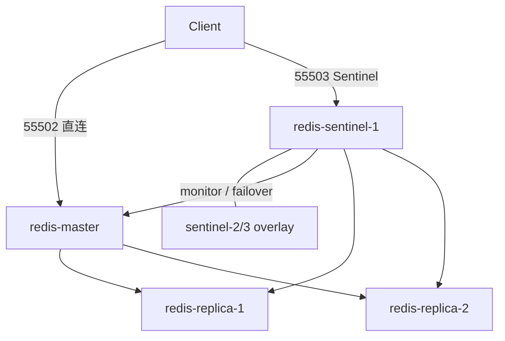

# Redis 8 Swarm Stack（1 主 2 从 3 Sentinel / 1m2r3s）

**Docker Swarm** 主从复制 + **3 节点 Sentinel** 自动故障转移（非 Redis Cluster）。

| 服务 | 角色 | 对外端口 |
|------|------|----------|
| 节点 | 服务 | 公网入口（集群外应用） |
|------|------|------------------------|
| sz-1 `120.24.64.42` | master | **55502** |
| sz-2 `120.79.138.3` | replica-1 | **55512** |
| sz-3 `120.76.239.44` | replica-2 | **55513** |
| 三节点公网 | Sentinel（ingress 仅 **sentinel-1** 发布 55503，三机 IP:55503 均可连） | **55503** |

`replica-announce-ip/port` 供启动脚本写入 `sentinel monitor`（公网:发布端口）；**勿**让 Jedis 连 overlay `10.0.x.x:6379`。

与 `../docker-stack/`（3 主 3 从 Cluster）可并存。

| 概念 | 值 |
|------|-----|
| 宿主机部署目录 | `/docker/redis/redis-stack-1m2r3s` |
| 数据目录 | `/docker/redis/redis-stack-1m2r3s/data/{master,replica-1,replica-2}` |
| Swarm stack 名 | `redis-1m2r3s`（overlay 网：`redis-1m2r3s_redis-repl-net`） |

## 1. 架构



- **Sentinel**：监控名 `myMaster`，quorum `2`（3 个 Sentinel 中至少 2 票同意才故障转移）
- **写**：优先用支持 Sentinel 的客户端连 `55503`，解析当前 master；或平时直连 `55502`
- **故障转移后**：`55502` 仍指向 `redis-master` 服务任务，**可能已不是当前主**；请改走 Sentinel 或 `SENTINEL get-master-addr-by-name myMaster`

## 2. 部署前准备

### 2.1 Swarm

```bash
docker info | grep Swarm
```

### 2.2 数据目录

将本仓库 `docker-stack-1m2r3s` 同步到三台节点的 `/docker/redis/redis-stack-1m2r3s`（含 `redis-stack.yml`、`conf/`、`scripts/`），然后：

```bash
cd /docker/redis/redis-stack-1m2r3s
./scripts/prepare.sh
# 或手动：
mkdir -p /docker/redis/redis-stack-1m2r3s/data/{master,replica-1,replica-2}
```

### 2.3 Secret（仅首次）

```bash
printf '%s' "${REDIS_PASSWORD:-changeme}" | docker secret create redis_1m2r3s_password -
```

### 2.4 防火墙（公网）

应用机（如 **sb4**）除 Sentinel 外，还必须能访问 **当前 master 的 Redis 发布端口**（Jedis 经 `GET-MASTER-ADDR-BY-NAME` 拿到地址后会直连该端口）。

| 端口 | 用途 | sb4 / 集群外应用 |
|------|------|------------------|
| **55503** | Sentinel（查 master、故障转移） | **必须放行** → 三台公网 IP |
| **55502** | sz-1 master 数据口 | **必须放行**（平时 master 在 sz-1 时） |
| **55512** | sz-2 replica-1 数据口 | failover 后若提升为主则需放行 |
| **55513** | sz-3 replica-2 数据口 | failover 后若提升为主则需放行 |

建议对 sb4 源 IP **同时放行** `55503 + 55502 + 55512 + 55513` 到三台 `120.24.64.42 / 120.79.138.3 / 120.76.239.44`，避免故障转移后换端口连不上。

仅本机运维可只开 `55503`，用 `sentinel get-master-addr-by-name` 后再测对应数据端口。

## 3. 部署

```bash
cd /docker/redis/redis-stack-1m2r3s
docker stack deploy -c redis-stack.yml redis-1m2r3s
docker service ls
```

期望 6 个服务均为 `1/1`（含 `redis-sentinel-1` ~ `3`）。

验收：

```bash
export REDIS_PASSWORD='changeme'  # 生产见 .env.example
./scripts/check-replication.sh
```

## 4. 客户端连接

### 4.1 直连主（无故障转移时）

```bash
redis-cli -h <Swarm节点IP> -p 55502 -a '密码' --no-auth-warning ping
```

### 4.2 通过 Sentinel 查当前主（推荐）

```bash
redis-cli -h <Swarm节点IP> -p 55503 -a '密码' --no-auth-warning \
  sentinel get-master-addr-by-name myMaster

redis-cli -h <Swarm节点IP> -p 55503 -a '密码' --no-auth-warning \
  sentinel masters
```

应用侧配置示例（Jedis / Lettuce / go-redis 等）：

- Sentinel 地址：`<IP>:55503`（可配多个 Swarm 节点 IP）
- Master 名：`myMaster`
- 密码：与 Secret 一致

**Spring Boot 4**：见 [spring/application-redis-sentinel.example.yml](spring/application-redis-sentinel.example.yml)（必须用 `spring.data.redis.sentinel`，勿直连 `55502`）。

## 5. 与 Redis 8 官方文档对齐

依据 [High availability with Redis Sentinel](https://redis.io/docs/latest/operate/oss_and_stack/management/sentinel/) 与 [Sentinel client spec](https://redis.io/docs/latest/develop/reference/sentinel-clients/)：

| 官方机制 | 本 stack 实现 |
|----------|----------------|
| `replica-announce-ip` / `replica-announce-port`（Redis，Docker/NAT 从库地址） | 各 `redis-master` / `redis-replica-*` 的 command 行 |
| `sentinel announce-ip` / `sentinel announce-port`（Sentinel 互发现，Docker/NAT） | 各 `redis-sentinel-*` 环境变量 + 启动脚本写入 |
| `sentinel monitor <name> <ip> <port> <quorum>` | 启动脚本：ip/port 取自 master 的 `replica-announce`（须为 Sentinel 可 PING 的发布端口） |
| `SENTINEL GET-MASTER-ADDR-BY-NAME` 返回 monitor 地址或 promoted replica 地址 | Jedis 只连 Sentinel `55503`，不直连 overlay |
| `SENTINEL SET <name> <option> <value>` 仅支持 `sentinel.conf` 中已有项（如 `quorum`、`down-after-milliseconds`、`auth-pass`） | **不使用** `SENTINEL SET ip/port` |
| 运行时增删监控：`SENTINEL MONITOR` / `SENTINEL REMOVE`（ip 须为 IPv4/IPv6 字面量） | 见 §7 临时修复示例 |
| Docker 端口映射非 1:1 时的限制 | 采用 announce + 发布端口；非 `host` 网络（官方另选方案） |

官方说明：端口映射下 Sentinel 监控 Redis 可能受限，推荐 `replica-announce-*` 与 `sentinel announce-*`；客户端通过 `GET-MASTER-ADDR-BY-NAME` 取地址后需对目标实例执行 `ROLE` 校验（Jedis/Lettuce 内置）。

## 6. 故障转移说明

1. `redis-master` 不可达超过 `down-after-milliseconds`（10s）后，Sentinel 发起选举。
2. 从 `redis-replica-1` / `redis-replica-2` 中提升新主（按 `replica-priority`、复制偏移）。
3. 原主恢复后，Sentinel 会将其 reconfigure 为从库（若仍可达）。
4. **Swarm 单节点** 时 3 个 Sentinel 可能同机，仍能 quorum=2，但机宕则整体不可用——生产建议 ≥3 台 Swarm 节点。

## 7. 从旧名迁移（`redis-stack-1m2s` / `redis-1m2s`）

若曾用旧目录或 stack 名部署过：

```bash
docker stack rm redis-1m2s          # 旧 stack
# 数据可迁移：mv /docker/redis/redis-stack-1m2s/data /docker/redis/redis-stack-1m2r3s/
# 或重新 prepare.sh

docker secret rm redis_1m2s_password   # 无引用后
printf '%s' "${REDIS_PASSWORD:-changeme}" | docker secret create redis_1m2r3s_password -

cd /docker/redis/redis-stack-1m2r3s
docker stack deploy -c redis-stack.yml redis-1m2r3s
```

## 8. 常见问题

### Jedis 仍连 `10.0.x.x:6379`（内网）

**原因**（[官方 Reconfiguring Sentinel](https://redis.io/docs/latest/operate/oss_and_stack/management/sentinel/#reconfiguring-sentinel-at-runtime)）：`SENTINEL GET-MASTER-ADDR-BY-NAME` 返回 `sentinel monitor` 中的 IP/端口。`SENTINEL SET` 仅可改 `quorum`、`down-after-milliseconds`、`auth-pass` 等 **sentinel.conf 已有项**，**没有** `ip`/`port` 选项。

**当前方案**：启动脚本从 master 读取 `replica-announce-ip/port`，写入：

`sentinel monitor myMaster 120.24.64.42 55502 2`

（公网发布端口，与 Jedis 一致。故障转移到从库后，Sentinel 会返回该从库的 `replica-announce`，如 `120.79.138.3:55512`。）

验证：

```bash
redis-cli -h 120.24.64.42 -p 55503 -a '密码' sentinel get-master-addr-by-name myMaster
# 正常：120.24.64.42 55502（或 failover 后对应从库公网端口）
```

**不重建 stack 的临时修复**（三台 Sentinel 各执行一次，IP/端口按当前主节点改）：

```bash
PW='changeme'
ANN_IP=120.24.64.42
ANN_PORT=55502
for S in 120.24.64.42 120.79.138.3 120.76.239.44; do
  redis-cli -h "$S" -p 55503 -a "$PW" --no-auth-warning SENTINEL REMOVE myMaster
  redis-cli -h "$S" -p 55503 -a "$PW" --no-auth-warning SENTINEL MONITOR myMaster "$ANN_IP" "$ANN_PORT" 2
  redis-cli -h "$S" -p 55503 -a "$PW" --no-auth-warning SENTINEL SET myMaster auth-pass "$PW"
done
```

### Jedis：`Failed to connect to sz-1.xhc-bot.com:55503`

1. **先确认 Sentinel 在监听**（sz-1 上）：
   ```bash
   docker service ps redis-stack-1m2r3s_redis-sentinel-1
   redis-cli -h 127.0.0.1 -p 55503 -a '密码' --no-auth-warning ping
   # 必须带 -a，且应有 PONG；若卡住说明 Sentinel 进程未起来（旧脚本公网探测无超时会卡死）
   ```
   若 `PONG` 失败，看 `docker service logs redis-stack-1m2r3s_redis-sentinel-1 --tail 50`（不应反复重启）。

2. **DNS**：`sz-1.xhc-bot.com` 须解析到 `120.24.64.42`；排查时 Spring 可先用 IP：`120.24.64.42:55503`。

3. **sb4 机器** 须放行三台 `55503`（Sentinel）及 **`55502/55512/55513`（Redis 数据）**。

### Sentinel 日志「回退 overlay monitor」或 `+sdown`

容器内常无法 PING 公网 `120.24.64.42:55502`（hairpin）。启动脚本**不再因此 exit**，但 monitor 可能暂用 overlay，Jedis 仍会连 `10.0.x.x`。根治：让 Sentinel 容器能访问公网发布端口，或三台执行 `SENTINEL REMOVE` + `SENTINEL MONITOR myMaster 120.24.64.42 55502 2` + `SENTINEL SET myMaster auth-pass <密码>`。

### 日志仍出现 `--connect-timeout` 报错

说明 **服务器上的 yml 未更新** 或 **Sentinel 任务未重建**（仍在跑旧 command）。本地应有 `sentinel-bootstrap v3` 且无 `--connect-timeout`：

```bash
grep -n connect-timeout redis-stack.yml   # 应无输出
docker stack deploy -c redis-stack.yml redis-stack-1m2r3s
docker service update --force redis-stack-1m2r3s_redis-sentinel-1
docker service logs redis-stack-1m2r3s_redis-sentinel-1 --tail 5 | head -1
# 第一行应含 sentinel-bootstrap v3
```

### 日志里的 `10.0.4.x` 是什么？

`getent redis-master` 打印的是 **Swarm overlay 内网 VIP**，只用于 Sentinel 容器**连接 master 做 CONFIG GET**。  
**Jedis 不应连这个 IP**；`GET-MASTER-ADDR` 应返回 **120.24.64.42:55502**（脚本已固定公网 monitor）。若 Jedis 仍是 10.0.x.x，说明 Sentinel 未成功启动或仍是旧配置。

### Sentinel 日志卡在「等待 redis-master 就绪」

主从已同步说明 **master 正常**，多半是 Sentinel 容器内 **DNS/密码** 问题（旧脚本无超时会像卡死）。

1. 同步最新 `redis-stack.yml` 后 `docker service update --force redis-stack-1m2r3s_redis-sentinel-{1,2,3}`。
2. 日志应出现 `重试 #5: ...` 和 `redis-master 已就绪 (redis-master -> 10.0.x.x:6379)`。
3. 进容器排查（把 `SVC` 换成实际 sentinel 服务名）：
   ```bash
   TASK=$(docker service ps redis-stack-1m2r3s_redis-sentinel-1 -q --filter desired-state=running | head -1)
   CID=$(docker inspect -f '{{.Status.ContainerStatus.ContainerID}}' "$TASK")
   docker exec -it "$CID" sh -c 'getent ahostsv4 redis-master; PW=$(cat /run/secrets/redis_password); timeout 3 redis-cli -h redis-master -a "$PW" ping'
   ```
4. 确认 Secret 存在且与 master 一致：`docker secret ls | grep redis_1m2r3s_password`。
5. 若同时部署了旧 stack `redis-1m2r3s`，先 `docker stack rm` 避免服务名冲突。

### Sentinel 启动报 `Can't resolve instance hostname`

`sentinel monitor` 行勿写 `redis-master` 主机名；使用 **公网 IP + 发布端口** 或已解析的 IP（见 `redis-stack.yml` 启动脚本）。

### `port '55503' is already in use by service ... sentinel-3`

Swarm **ingress** 下同一 stack 只能有一个服务 `published: 55503`。本方案仅 `redis-sentinel-1` 发布；`sentinel-2/3` 经 overlay 参与 quorum。修复后若 deploy 半失败，先 `docker stack rm redis-stack-1m2r3s` 再重新 deploy。

## 9. 运维

| 操作 | 命令 |
|------|------|
| 更新 stack | `docker stack deploy -c redis-stack.yml redis-1m2r3s` |
| 更新 Redis 配置 | `export REDIS_CONFIG_VERSION=v2` 后 deploy |
| 更新 Sentinel 配置 | `export SENTINEL_CONFIG_VERSION=v2` 后 deploy |
| 下线 | `docker stack rm redis-1m2r3s` |

## 10. 文件

```
docker-stack-1m2r3s/
├── redis-stack.yml
├── conf/
│   ├── redis.conf      # 主/从公共配置（密码、replicaof 由 command 注入）
│   └── sentinel.conf   # 官方 down-after / failover-timeout；monitor/announce 由脚本注入
├── scripts/
│   ├── prepare.sh
│   └── check-replication.sh
└── spring/
    └── application-redis-sentinel.example.yml
```
